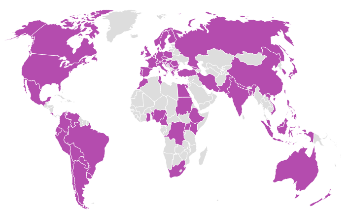
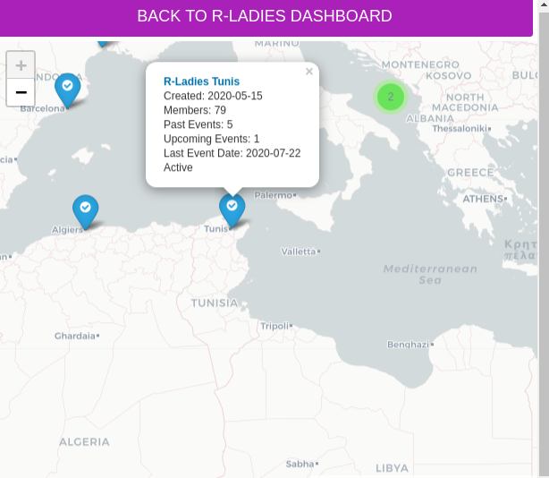
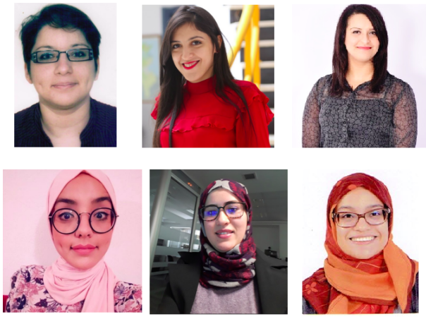

```{r setup, eval = TRUE, include=FALSE}
options(htmltools.dir.version = FALSE)
```

class: center, middle

# R-Ladies initiative

---
background-image: url(https://alison.rbind.io/slides/images/rladies-r-logo.png)
background-position: top right
background-size: 110px 120px
layout: true
---

# MISSION


- [R-Ladies](https://rladies.org/about-us/) is a Worldwide organization with more than 170 groups worldwide.


- Promotes `gender diversity` in the R community.


- Proportionates representation and support **minority gender R enthusiasts** to achieve their `programming potential`via meetups, mentorship & global collaboration.


- Builds a collaborative global network of R leaders, mentors, learners and developers to facilitate `individual and collective progress worldwide`.

```{r graphics, echo=FALSE}

```

---
class: inverse, center, middle
layout: false
# History

---
background-image: url(https://i.insider.com/5d438698100a24104b18d1ad?width=900&format=jpeg&auto=webp)
background-position: 50% 50%
class: center, bottom, inverse

# Gabriela de Queiroz, senior engineering and data science manager at IBM and founder of R-Ladies 

---
class: inverse, center, middle

# R-Ladies Tunis
---
background-image: url(https://alison.rbind.io/slides/images/rladies-r-logo.png)
background-position: top right
background-size: 110px 120px
layout: true

---
# About us

- `R-Ladies Tunis` is part of the R-Ladies initiative. 


- It was created in May 2012 by `Tunisian Ladies` working as data scientists in different fields and bioinformaticians `passionate` about R programming.

- Our goal is to create an R community in Tunis and `encourage, inspire and empower` currently `underrepresented genders` in the `R community`.
```{r graphics1, echo=FALSE}

```
---
# The team 
```{r graphics2, echo=FALSE}

```
---

class: inverse, center, middle
layout: false
# Come and join us

---
# Social Media

LinkedIn : https://tinyurl.com/y8hlt5np

Meetup : https://www.meetup.com/rladies-tunis/

Twitter : https://twitter.com/RLadiesTunis

Instagram : https://www.instagram.com/rladiestunis/

Youtube_Channel : https://tinyurl.com/ycm48c6w

Github : https://github.com/rladiestunis

Facebook : https://www.facebook.com/RLadiesTunis/
---

class: inverse,center, middle

# Thanks!
